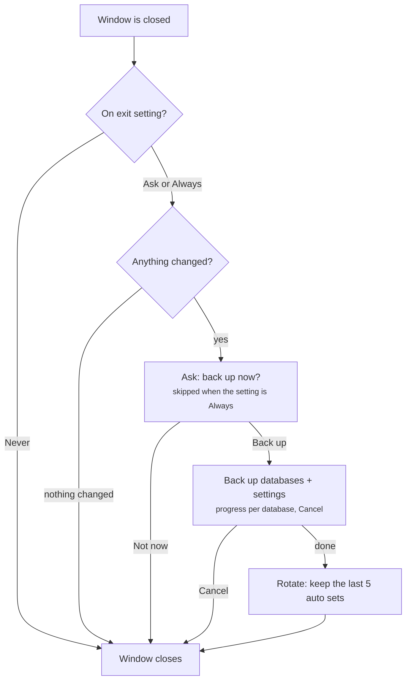

# Backup Support — Design (Epic #942)

*Agreed 1 October 2026. Update this file in the same commit when a sub-issue changes the design.*

*1 October 2026 (#953): OpenSAK has no Database menu — database actions live in the File menu, so backup and restore are File → Back up now… and File → Restore from backup….*

*5 October 2026 (#959): change detection ignores an empty `-wal` and records the state again after the database is closed — see "When nothing changed, nobody is asked". A manual backup of only some databases records only those.*

*5 October 2026 (#959): the on-exit setting and the number of automatic backups to keep are in Settings → Advanced → Backups. The prompt's button is "Back Up and Close"; with the setting Always and a backup folder that can't be used (e.g. a drive that isn't connected), the prompt is shown instead.*

*6 October 2026 (#986): the Welcome Wizard has a backup folder page after the database folder page, and Settings → Advanced → Folders has a backup folder row. Both check the folder against the install and database folders as entered on screen, before they are saved. Skip leaves `backup.dir` unset; a folder is only stored when the user finishes the wizard or changes the row.*

*6 October 2026 (#988): "once a backup folder is set" means `backup.dir` is set explicitly and the folder passes `folder_available()` and `validate_backup_dir()` at migration time; otherwise the copy goes next to the database. File names carry the first 8 characters of `db_uuid`, or of a hash of the database path for a database from before #659, so two `Default.db` from different folders don't collide. `folder_available()` moved from the exit dialog into `backupset.py`.*

*6 October 2026 (#989): optional compressed sets, setting `backup.compress`, default off (Settings → Advanced → Backups). A compressed set is `<set name>.zip` with the same layout inside (`manifest.json`, `databases/`, `settings/`). It is written as `<name>.zip.partial` and renamed when complete, manifest last; databases are snapshotted one at a time into `<name>.partial/`, added to the zip and removed, so the extra space needed while writing is the largest database plus the zip (~0.6 × total assumed) — less than a folder set for several databases, more for a single big one. Deflate level 1: on a 234 MB test database 3.1 s against 0.8 s for a folder set and 13.7 s at zlib's default level 6, giving 53 MB. Listing reads the manifest from the zip; rotation and partial cleanup handle zips and folders alike. Restore unpacks one database next to its target in the database folder (room for twice its size is checked first), copies it with the usual integrity check and removes the unpacked file, also on cancel. Pre-migration copies are never compressed.*

*6 October 2026 (#987): a settings restore is staged, not applied in the running app. `stage_settings_restore()` writes a settings-only set of kind `safety` (never rotated) and copies the backup's allow-listed settings into `<install>/settings-restore-pending/`; `apply_pending_settings_restore()` runs in `app.main()` right after the macOS path migration, before anything reads the settings, because the running app keeps opensak.json in memory and would overwrite a restore on its next write. There is no automatic restart (as for updates): the dialog offers to close OpenSAK, and the main window reports the result after the next start. Kept from the current opensak.json: `databases.*`, `backup.*`, `window.*`, `paths.*`, `updates.*` and internal `_*` keys. `filters/`, `column_views/` and `icons/` are replaced only where the backup has them. A pending restore that fails to apply is moved to `settings-restore-failed/` and the previous settings stay in use. Settings from a newer OpenSAK version are refused.*

## Summary

OpenSAK gets GSAK-style full backups: a user-chosen backup folder, a prompt on exit, manual backups any time, and a restore that brings a database back exactly as it was when the backup was taken. Automatic backups are rotated (keep the last 5 by default); manual backups are never deleted by OpenSAK.

The foundation shipped in the 1.21.0 cycle, so this epic builds on it rather than starting from scratch:

| Issue | What it gives the backup feature |
| --- | --- |
| #943 | `snapshot_database()`: a consistent, self-contained copy, safe while the database is open, atomic, with progress and cancel |
| #549 | A one-time backup before a schema migration (stays as is; can use the backup folder once one is set) |
| #659 | Per-database settings (home, columns, sort, last filter profile) live inside the database file, plus a stable `db_uuid` |

**Goals**

- Protect every user's data today, before macros and scheduled imports can change many caches unattended.
- Restoring never destroys anything: a restored database is always a new database.
- Backups stay small enough to live with: rotation, and no prompt when nothing changed.

## Decisions

Agreed on 1 October 2026; the sections below work these out.

| Topic | Decision |
| --- | --- |
| Location | A user-chosen backup folder, set in the Welcome Wizard and changeable in Settings |
| Rotation | Automatic (on-exit) backups keep the last N, default 5; manual backups are never deleted automatically |
| Content | A full backup: all databases plus the settings folder, so a restore shows a database exactly as it was |
| Restore | Always creates a new database with the same `db_uuid`; never overwrites a database in place |
| Automation | As in GSAK: on exit, OpenSAK asks whether to back up; the user can choose Ask / Always / Never |
| Scope | Container/type display stays global (#659); scheduled backups and cloud targets are later work |

## Backup folder

One setting, `backup.dir`, in opensak.json. It is app-level, not per database: one folder holds the backups of all databases.

**Where it is set**

- **Welcome Wizard:** a new page after the database folder page (the wizard today has: language, install folder, database folder, Geocaching.com profile, done). It suggests a default and explains why another disk is better.
- **Settings → Advanced:** the same folder row as the install and database folders, so existing users can set or change it.
- **First on-exit prompt:** existing users never see the wizard again. If no folder is set when the first backup is about to run, the prompt asks for one (with the default pre-filled) instead of failing.

**Default**

`<Documents>/OpenSAK Backups` on all platforms. It is easy to find, survives an uninstall, and is outside the install folder, which in-app uninstall may remove. The folder is created on first use.

**Advice shown to the user**

A backup on the same disk protects against mistakes, but not against a failing disk. The wizard page and the Settings row say so in one line, and suggest an external drive or a synced folder.

**Changing the folder**

Existing backups stay where they are and are not moved. The Restore dialog lists backups from the current folder and has a Browse button for any other folder, so older backups remain reachable.

**#549 pre-migration backups** go into `<backup folder>/pre-migration/` once a backup folder is set, and next to the database as today when it isn't.

## Backup set format

Each backup is one plain folder by default, so a user can restore by hand without OpenSAK and large databases aren't slowed down by compression. Compression is an opt-in setting (#989, see below).

```
OpenSAK Backups/
  OpenSAK-backup-2026-10-01_1830-auto/
    manifest.json
    databases/
      Default.db
      Denmark.db
    settings/
      opensak.json
      filters/          (filter profiles)
      column_views/     (Column View templates)
      icons/            (the user's own icons)
```

**Folder name:** `OpenSAK-backup-<YYYY-MM-DD_HHMM>-<auto|manual>`, local time. The kind in the name makes rotation visible to the user too. Two backups in the same minute get a `-2` suffix.

**Contents**

| Included | Not included |
| --- | --- |
| Every database in the database list whose file exists, also those outside the database folder | Log files |
| opensak.json, filters/, column_views/, icons/ from the install folder | The Geocaching.com token file and keyring passwords (credentials never go into a backup) |
| | bootstrap.json (it only points to the install folder on this machine) |

Databases are written with `snapshot_database()` (#943), so a backup is consistent even for the open database.

**manifest.json** describes the set and is written last:

```json
{
  "format": 1,
  "kind": "auto",
  "created": "2026-10-01T16:30:12Z",
  "opensak_version": "1.21.0",
  "databases": [
    {"name": "Default", "file": "databases/Default.db",
     "db_uuid": "9f2c…", "schema_version": 24, "size_bytes": 52428800}
  ],
  "settings": true
}
```

**Never half a backup:** the set is built in a folder ending in `.partial` and renamed only when everything, manifest last, is written. A folder without a manifest is ignored by Restore and cleaned up at the next backup.

**Rotation:** after a successful automatic backup, OpenSAK deletes the oldest `auto` sets beyond the newest N (setting `backup.keep_auto`, default 5, minimum 1). `manual` sets, `pre-migration/` and folders OpenSAK didn't create are never touched.

## Backup flows

There are two ways to start a backup; both write the same kind of set and differ only in `kind` and rotation.

**Manual: File → Back up now…**

A small dialog: the backup folder (with Browse), all databases checked by default with the option to untick some, and a Back up button. Settings are always included. The result is a `manual` set, never rotated away.

**On exit**

Setting `backup.on_exit` = Ask (default) / Always / Never, in Settings and remembered from the prompt's "Don't ask again" box.



Never, nothing changed, Not now and Cancel all close the window without a backup; rotation runs only after a completed backup.

**When nothing changed, nobody is asked.** After every successful backup OpenSAK records, per database, the size and modification time of the `.db` and `-wal` files, plus the newest change in filters/ and column_views/ (`backup.last_state` in opensak.json). On exit, if all of these still match, there is nothing new to protect and the window just closes. opensak.json itself is left out of the check: OpenSAK writes the window geometry to it on every exit.

Two details keep this check honest (#959):

- **SQLite rewrites the files on close.** When the last connection closes, SQLite checkpoints the WAL into the `.db` file, so its size and modification time change although the content doesn't, and the next start creates an empty `-wal` with a new modification time. So an empty or missing `-wal` counts as no WAL, and when the window closes with nothing left to back up (nothing changed, or the on-exit backup just finished), OpenSAK closes the database after the event loop ends and records the state once more (`exit_state.finalize_after_close()`, called from app.py). Without this, every exit after a session with changes would ask again at the next exit.
- **A manual backup of some databases** records only those. A database that was left out keeps its earlier recorded state, so a change to it still counts. A database whose file is missing is recorded as it is, since no backup can include it.

OpenSAK also closes itself without a normal close: after an in-app update has replaced the app, after an in-app uninstall, and when the OS session ends. None of these offer a backup (`exit_state.suppress_exit_backup()`). On macOS a logout can't be told apart from Quit, so the prompt may appear then and hold up the logout until it is answered.

Sorting a column or changing the home location now writes to the database (#659), so it counts as a change. That is intended: it is something a restore would bring back.

**Progress and cancel.** A full backup of large databases takes time, so it runs in a worker thread behind a modal progress dialog (per database and in total). Cancel stops at once, removes the `.partial` folder, and closes the app. The window stays open until the backup has finished or been cancelled.

**Before starting** OpenSAK checks free space on the backup folder's disk (total size + 10 %). If it is short, the prompt says so and offers Close anyway or Cancel.

## Restore flow

Restore adds; it never replaces. A restored database is always a new entry in the database list, and settings are only restored when the user asks for it.

**File → Restore from backup…**

1. The dialog lists the sets in the backup folder, newest first: date, auto or manual, OpenSAK version, databases. Browse opens a set anywhere else.
2. The user picks a set, ticks the databases to restore, and optionally ticks "Also restore settings".
3. Each database is checked before anything is added: it must pass `PRAGMA integrity_check`, and its schema must not be newer than this OpenSAK (a backup from a newer version is refused with a clear message).
4. It is copied with `snapshot_database()` into the database folder as `<name> (restored YYYY-MM-DD).db`, with the same display name, and added to the list. It keeps its `db_uuid`: it is the same database at an earlier point in time (#659).
5. OpenSAK offers to switch to the restored database. Because home, columns, sort and last filter profile live inside the file (#659), it opens exactly as it was.

**Filter profiles a restored database needs.** Profiles in the backup that no longer exist are added back; a profile with the same name is left as it is today. This also happens without "Also restore settings", so a restored database finds its last filter profile.

**Also restore settings** (opt-in, with a confirmation):

- First, the current settings are saved as a settings-only `safety` set, so this step can be undone.
- filters/, column_views/ and icons/ are replaced by the backup's copies.
- opensak.json is restored except for the keys that describe this machine or the present: the database list and active database, install, database and backup folders, and the `backup.*` state. Otherwise the restored database entries would vanish again.
- The restored settings are applied at the next start (no automatic restart; see the #987 note at the top).

## Edge cases and risks

| Case | Handling |
| --- | --- |
| Very large databases (29 GB seen in GSAK) | Progress per database and Cancel; free-space check first; "Don't ask again" lets heavy users switch to manual backups |
| OS shutdown or logout while OpenSAK is open | No prompt and no backup: there is no time to finish one. Only a normal window close asks |
| Backup folder on a drive that isn't connected | The prompt says the folder is unavailable and offers Choose another folder or Close without backup |
| Backup folder inside the database or install folder | Refused in the folder picker: a backup inside what it backs up would copy itself and be removed by an uninstall |
| Restoring the same set twice | The second copy gets a `-2` suffix in its file and display name |
| Restoring a backup from an older OpenSAK | Allowed; the database is migrated when opened, and #549 keeps a pre-migration copy of the restored file |
| Restoring a backup from a newer OpenSAK | Refused for databases whose schema is newer; the message names the version needed |
| A database file in the list is missing | Skipped and named in the result; the backup still completes |
| Windows file locks and antivirus (#540) | Snapshots read through SQLite, never by copying the open file; recommend excluding the backup folder from real-time scanning as for the database folder |
| Microsoft Store (MSIX) install | Documents is outside the package, so backups are never virtualized or removed with the app (#820) |

## Sub-issues and order of work

Seven sub-issues under #942, each its own commit and test run, in this order. 1–4 are the 1.21.0 target; 5–7 can follow in 1.21 if time allows, or in 1.22.

1. **Backup core** — `opensak/backup/backupset.py`: write a set (folder layout, `.partial`, settings copy, manifest last), list and read sets, rotation; `backup.dir` setting with the Documents default. No UI. Builds on #943 and #659.
2. **Manual backup** — File → Back up now…: folder, database selection, worker thread with progress and Cancel. Depends on 1.
3. **Restore databases** — File → Restore from backup…: list sets, validate, restore as new with the same `db_uuid`, add missing filter profiles, offer to switch. Depends on 1.
4. **On-exit prompt** — `backup.on_exit` (Ask / Always / Never), "Don't ask again", change detection, folder choice on first use, closeEvent integration. Depends on 1 and the worker from 2.
5. **Backup folder in setup** — Welcome Wizard page and Settings → Advanced row, with the other-disk advice. Depends on 1; touches Roadmap #4 (Welcome Wizard).
6. **Restore settings** — the opt-in part of restore: safety set, replace folders, merge opensak.json, applied at the next start (#987). Depends on 3.
7. **Pre-migration backups in the backup folder** — move #549's copies to `<backup folder>/pre-migration/` when a folder is set. Depends on 1.

Each sub-issue updates `docs/` and the User Guide as it lands; `docs/Uninstalling-OpenSAK.md` should say that backups in Documents are kept after an uninstall.

## Out of scope for now

- Scheduled backups while OpenSAK is running (daily, weekly). They fit naturally with the headless CLI import (#937) once that lands.
- Cloud or network targets beyond pointing the backup folder at a synced folder.
- A restore that replaces a database in place. Ruled out in #659: restore always adds.
- Cleaning up the legacy per-database keys in opensak.json (#659), once 1.20 no longer matters.
